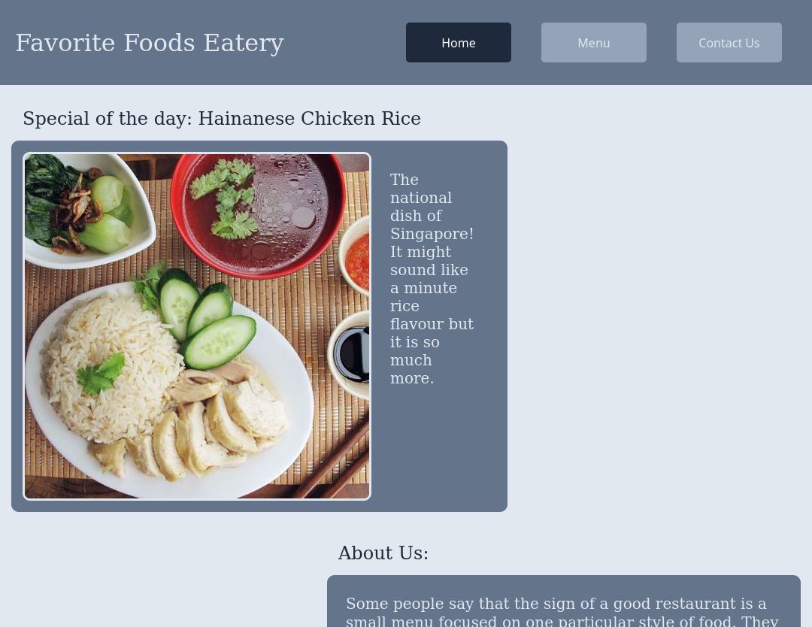

## Restaurant Website

View the project live [here](https://brenton-j-andrews.github.io/odin_restaurant/).

--- 

#### About this project

Completed for [The Odin Project](https://www.theodinproject.com/lessons/node-path-javascript-restaurant-page) JavaScript course.

This basic restaurant website served as an introduction to dynamically rendering content and using NPM and webpack.

---

#### Frameworks

Ths project was built with vanilla JavaScript, HTML and CSS.

---

#### Takeaways

I am writing this README 6 months after the completion of this project and it is nice to see that I have progressed a good amount. While working thru this one, the extra JSON and webpack config files didn't really make any sense to me and I wasn't entirely sure of their function. Now that isn't an issue! 

---

#### Todo

- Change image file paths to public folder so that menu item images render properly.
